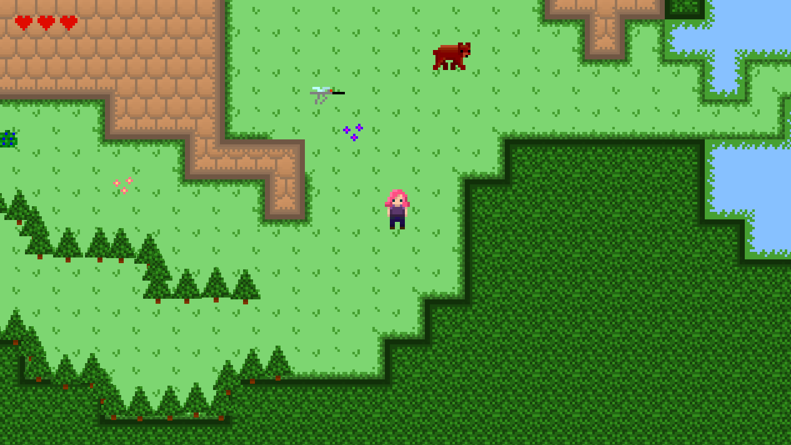

# Alice-i-verkalix
A adventure game created in Godot in the GameJam Kodsnack Spelsylt.

The theme was Norrland, which is basically the half north part of Sweden. 

This game is about Alice that lives in the forrest in the town Överkalix. She wakes up one morning and notice she is out of coffee. She decides to walk to her neighbour, 10 km away to lend some coffee. 
Your job is to take Alice there and stay away from mosquitos, mooses and bears.

Coded in Godot and GDScript. Graphics are made in paint.net. Music is made in Soundtrap and sound effects are made in sfxr

